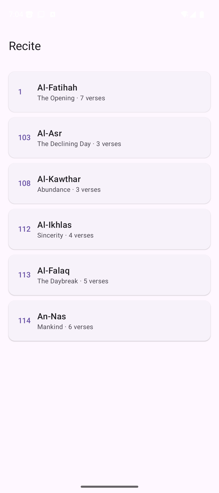
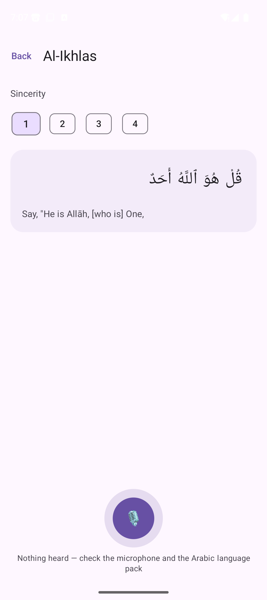

# Recite

An Android Qur'an reader that listens while you recite and shows, word by word,
which words it matched.

| | |
|---|---|
|  |  |

Running on an Android 16 emulator.

## What it does

- Six short surahs — Al-Fatihah, Al-'Asr, Al-Kawthar, Al-Ikhlas, Al-Falaq, An-Nas.
- Tap a verse, tap the microphone, recite. The verse then animates: matched words
  turn green, misread words amber, skipped words grey.
- Verse words fade in right-to-left as the verse is read; the microphone's rings
  pulse to your actual input level; the score bar animates to the result.

| | |
|---|---|
|  |  |

Running on an Android 16 emulator.

## What it does **not** do

**It does not check your tajweed, and it cannot tell you your recitation is
correct.**

Matching works on words. To compare a speech recogniser's output against Uthmani
script, both sides are stripped of harakat, tanwin, shadda, sukun and the Quranic
annotation marks, and the alif, ya and ta-marbuta variants are folded together.
Those marks are exactly where tajweed lives — madd length, ghunnah, qalqalah,
makharij. The comparison deletes them before it starts.

So a full score means *the right words, in the right order*. It says nothing
about whether they were recited correctly. This is a memorisation aid. It is not
a teacher, and it is not a substitute for one.

Recognition quality is the device's, not this app's: it depends on the Arabic
language pack being installed and on a vendor engine that was trained on ordinary
speech, not recitation. A poor result usually means the recogniser did not
understand, not that the recitation was wrong.

## The text — where it comes from

| | |
|---|---|
| Arabic | [Quran.com API v4](https://api.quran.com/api/v4), endpoint `/quran/verses/uthmani`, field `text_uthmani` — the Uthmani script Quran.com serves |
| Translation | Saheeh International (English), the same API, translation resource id `20` |
| Fetched by | [`tools/fetch_quran.py`](tools/fetch_quran.py) |
| Stored at | `app/src/main/assets/quran.json`, committed verbatim |

**No Qur'anic text is typed by hand**, here or anywhere in this repository.
Writing scripture from memory risks errors that would be both a correctness
failure and a serious one, so it is fetched from a published source and committed
exactly as received. Rerun the script to regenerate.

If you would rather use a different published text or translation, change the
`SURAHS` list and the translation id in that script and rerun it.

## Build and test

```bash
./gradlew :core:test        # 14 tests on the matching logic
./gradlew :app:assembleDebug
```

Needs JDK 17 and the Android SDK (`ANDROID_HOME` set), compileSdk 35, minSdk 26.

## Layout

```
core/    pure Kotlin — ArabicNormalizer and RecitationMatcher, and their tests.
         No Android dependency, so the logic that judges a recitation is
         testable without a device.
app/     Compose UI, SpeechRecognizer wrapper, bundled text.
tools/   the fetch script.
```

The matcher aligns by longest common subsequence rather than comparing position
by position — one dropped word would otherwise shift the rest of the verse and
report every later word as wrong. A word outside the alignment is *missed* when
nothing was heard near it and *misread* when something was, because skipping a
word and mispronouncing one are different mistakes to a learner.

## Honest status

- `core` is tested and green — 14 tests.
- `app` builds and **runs on an emulator**: the surah list, verse rendering
  (right-to-left, diacritics intact), verse switching, the microphone permission
  prompt, and the listening state all work. Screenshots above are from that run.
- **The recognition result itself is still unverified.** An emulator has no
  microphone, so nothing has ever been recited into this app. The path from
  recognised text to a score is covered by unit tests, but the path from a human
  voice to recognised text has never run. That is the part to distrust until you
  try it on a phone.
