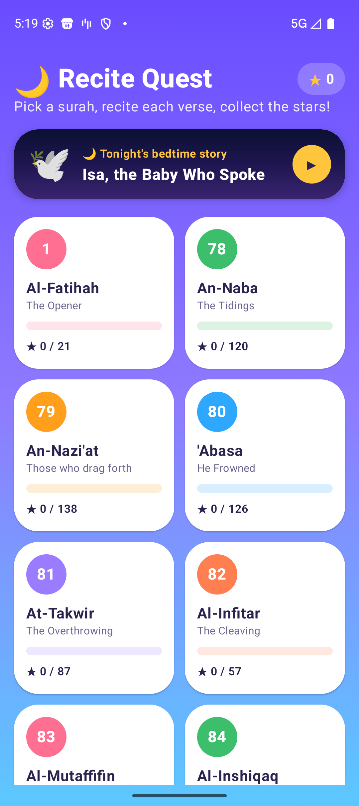
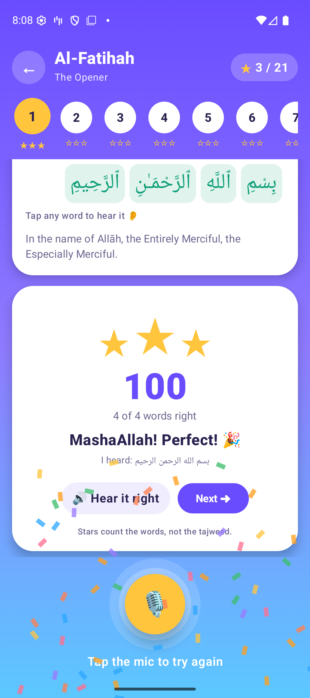
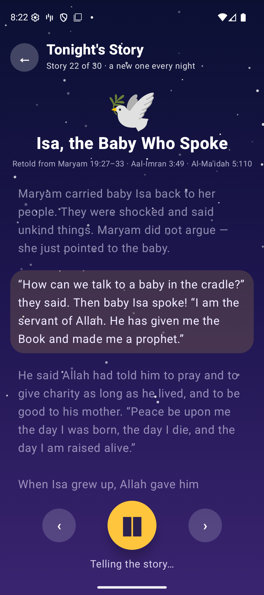

# Recite


An Android Qur'an reader for children that plays like a game. It listens while
you recite, lights up the words it hears, gives up to three stars for each verse,
and plays the correct recitation when you slip. At night it tells a story from
the Qur'an.

| | | | |
|---|---|---|---|
|  |  |  |  |

Pixel emulator, Android 16. The emulator has no microphone, so the result in the
third screenshot was injected in place of the speech recogniser. The screen that
shows it is the real one.

## What it does

- **38 surahs, 571 verses.** Al-Fatihah plus all of Juz 'Amma (78–114), shown
  as a grid of levels. Each level fills up with stars as you go.
- **Recite a verse and get a score.** Tap the microphone and recite. Words
  turn green one by one as the recogniser hears them. At the end each word gets
  its result: green if matched, orange if misread, grey if skipped, and the
  slips shake. A score counts up and 1–3 stars pop in. A perfect verse sets off
  confetti. The best stars for each verse are saved on the device.
- **One verse, or the whole surah.** In *whole surah* mode the child recites
  the entire surah in one go. The recogniser stops at every pause, so the app
  keeps restarting it and stitches the sessions together. It scrolls along
  with the recitation, scores the surah, and gives every verse its own stars.
- **Hear it right.** After a verse that isn't perfect, the qari recites it
  automatically. The recording is Mahmoud Khalil al-Husary's teaching recitation
  (*al-Mu'allim*), slow and clear so it is easy to copy. You can tap **any
  word** to hear just that word, so a child can go straight to the orange ones.
- **English or Bahasa Indonesia.** A switch on the home screen changes
  everything: the verse translation (Saheeh International or Kemenag), the
  surah meanings, the stories and their voice, and every word of the app. It
  starts in the phone's language.
- **Bedtime stories.** 30 stories from the Qur'an, one for each night of the
  month: Adam, Nuh, Ibrahim, Yusuf, Musa, Sulayman and the ant, Yunus, the People
  of the Cave and more. The device's own voice reads each story aloud and lights
  each paragraph as it goes. Each story ends on its real verse, which the qari
  recites.

## What it does **not** do

**It does not check your tajweed, and it cannot tell you your recitation is
correct.**

Matching works on words. The speech recogniser gives back modern Arabic
spelling with no harakat. To compare that against Uthmani script, both sides are
stripped of harakat, tanwin, shadda, sukun and the Quranic annotation marks, and
letter variants are folded together. Those marks are exactly where tajweed
lives: madd length, ghunnah, qalqalah, makharij. The comparison deletes them
before it starts.

Tajweed can't be added on top, because the evidence is gone before the app sees
it. A speech recogniser keeps *what* was said and throws away *how*: it hands
back text, never the audio. It was also trained to turn ordinary speech into
words, so it is built to ignore the very things tajweed is about, like a madd
held for two counts or six, or a nasal ghunnah. Checking tajweed would take:

1. the raw audio, recorded by the app itself rather than through the recogniser;
2. an acoustic model trained on *recitation*, one that outputs phonemes rather
   than words;
3. forced alignment of those phonemes against the verse's expected
   pronunciation, which you can derive from the tajweed-annotated text;
4. rules scored on the aligned audio: how long each madd is, whether nasal
   sound is present for ghunnah, the bounce of qalqalah, and the point of
   articulation for each letter.

Each of those is a research project, and none is solved well enough to tell a
child they recited *correctly*. A wrong "correct" is worse than no answer. So a
full score here means *the right words, in the right order*, and nothing more.
This is a memorisation aid. It is not a teacher, and it is not a substitute for
one.

Recognition quality is the device's, not this app's. It depends on the Arabic
language pack being installed, and on a vendor engine trained on ordinary speech,
not recitation. A poor result usually means the recogniser did not understand,
not that the recitation was wrong.

### Spelling, and how often a right word is marked wrong

Uthmani script and modern spelling write some words differently: ٱلرَّحْمَـٰنِ
is spelled الرحمن, ٱلْحَيَوٰةَ is الحياة, أَدْرَىٰكَ is أدراك, and وَٱلَّيْلِ is
والليل. The normalizer folds these together. Quran.com also publishes the same
verses in modern spelling (*imlaei*). Scored against that text, a perfectly read
Juz 'Amma had **95 of 2,337 words (4%) marked wrong before these folds, and 17
(0.7%) after**. The 17 left are rarer spellings, such as vocative يا joined to
the next word, or a hamza on a different seat.

## Where everything comes from

| | |
|---|---|
| Arabic | [Quran.com API v4](https://api.quran.com/api/v4), endpoint `/quran/verses/uthmani`, field `text_uthmani`: the Uthmani script Quran.com serves |
| Translation | Saheeh International (English), resource id `20`, and the Indonesian Ministry of Religious Affairs (Kemenag), resource id `33`, from the same API |
| Word audio | Quran.com word-by-word audio (`audio.qurancdn.com`). The path for each word is fetched, because the numbering skips a slot at every standalone pause mark and cannot be computed. |
| Verse audio | Mahmoud Khalil al-Husary, *al-Mu'allim* (`everyayah.com`), streamed |
| Story voice | the device's text-to-speech engine, English or Indonesian. Some phones need the Indonesian voice downloaded in the system's text-to-speech settings. |
| Fetched by | [`tools/fetch_quran.py`](tools/fetch_quran.py) |
| Stored at | `app/src/main/assets/quran.json` and `story_verses.json`, committed verbatim |

**No Qur'anic text is typed by hand**, here or anywhere in this repository.
Writing scripture from memory risks errors that would be both a correctness
failure and a serious one, so it is fetched from a published source and committed
exactly as received. Rerun the script to regenerate.

**The bedtime stories are the exception, and they are not scripture.** They are
retellings for children, written for this app in English and Bahasa Indonesia,
in [`stories.json`](app/src/main/assets/stories.json). Each one lists the verses it
retells. They stick to what those verses say. Where a detail comes from history
rather than the Qur'an (Abraha, Abu Bakr, the cave of Hira), the story says so.
Hard scenes are softened, never invented, and one is left out and flagged (the
boy in 18:74). The only Qur'anic text in a story is the verse it ends on, and
that verse is fetched. **Please have someone knowledgeable read the stories
before a child hears them.** The app also tells grown-ups this at the bottom of
every story.

## Build and test

```bash
./gradlew :core:test        # 19 tests on the matching logic
./gradlew :app:assembleDebug
```

Needs JDK 17 and the Android SDK (`ANDROID_HOME` set), compileSdk 35, minSdk 26.
Streaming audio needs the network, and so does recognition when the device has
no offline Arabic pack.

## Layout

```
core/    pure Kotlin: ArabicNormalizer and RecitationMatcher, and their tests.
         No Android dependency, so the logic that judges a recitation is
         testable without a device.
app/     Compose UI; SpeechRecognizer, MediaPlayer and TextToSpeech wrappers;
         bundled text and stories.
tools/   the fetch script.
```

The matcher aligns by longest common subsequence rather than comparing position
by position. Otherwise one dropped word would shift the rest of the verse and
report every later word as wrong. A word outside the alignment is *missed* when
nothing was heard near it and *misread* when something was, because skipping a
word and mispronouncing one are different mistakes to a learner.

## Honest status

- `core` is tested and green: 19 tests. One of them checks all 571 bundled
  verses to make sure the words drawn on screen line up one for one with the
  words scored. 22 standalone pause marks (ۖ ۚ ۩, and ۞ at the start of a verse)
  used to shift every word after them onto its neighbour's colour.
- Verified on an emulator (Android 16): the level grid, word taps streaming
  word audio, the qari's verse audio, the stars, score and confetti, saved
  progress, whole-surah mode across seven recogniser sessions, the switch to
  Indonesian, and the story voice reading paragraph by paragraph in both
  languages. For the score screens, a recogniser result was injected in place
  of the microphone.
- In whole-surah mode, a word spoken in the ~150 ms while the recogniser
  restarts can be lost. Some phones also beep each time it restarts.
- An earlier build ran on a physical device (Redmi Note 9, Android 12). There,
  the recogniser resolved to Google's full engine and **accepted Arabic**: on
  silence it returned `NO_MATCH`, not `LANGUAGE_UNAVAILABLE`.
- On the Redmi, real recitation has now earned stars (17 of 21 on
  Al-Fatihah), so voice to recognised text to score works end to end on a
  phone. How often a *correct* recitation of harder verses is misheard is still
  unmeasured.
